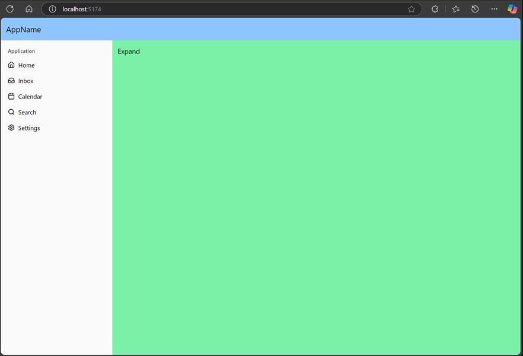
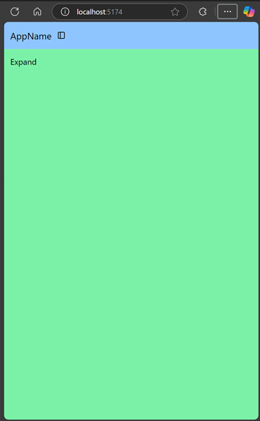
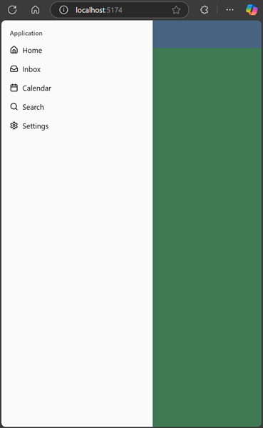

# Shad-cn sidebar component playground

This project demonstrates how to tweak the [shad-cn/ui sidebar component](https://ui.shadcn.com/docs/components/sidebar) so that it doesn't take up the whole height of the screen.

It was necessary to do a slight refactoring of the generated `components/ui/sidebar.tsx file` to make this possible - we had to split out the `<SidebarWrapper>` component from `<SideBarContext>`.


## How make the sidebar not take up the full viewport height in your project

1. Install the sidebar component from shadcn/ui:

   ```bash
   npx shadcn-ui@latest add sidebar
   ```

2. Tweak the generated `components/ui/sidebar.tsx` file to split out the `<SidebarWrapper>` component from `<SideBarContext>`. (see [src/components/ui/sidebar.tsx](./src/components/ui/sidebar.tsx) for the full code).
3. Render the `<SidebarWrapper>` component in your app in the position you want the sidebar to be.
4. Give the `<SidebarWrapper>` component a `className` of `relative h-full min-h-auto` and the `<Sidebar>` underneath it a `className` of `absolute h-full` (see [src/App.tsx](./src/App.tsx))

## Results



